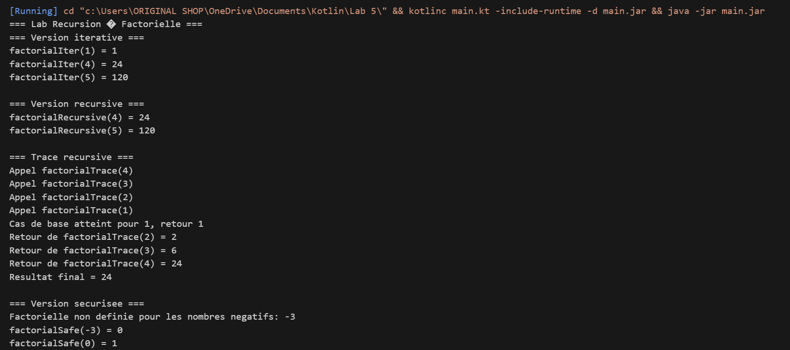
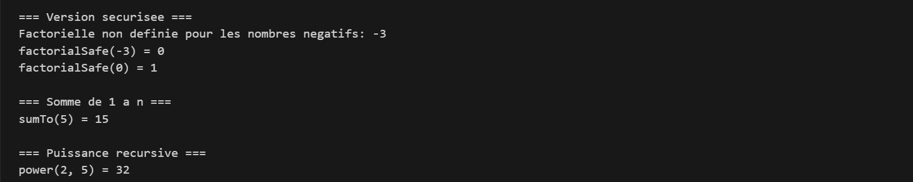

# LAB 5 — Récursion : Calculer la factorielle

## 📚 Cours
 Fondamentaux de la programmation en Kotlin

---

## 🎯 Objectif général

À la fin de ce lab, l’étudiant est capable de :
 - Expliquer ce qu’est la récursion.
 - Identifier un cas de base (base case) dans une fonction récursive.
 - Implémenter la factorielle :
    - avec une boucle (factorialIterative)
    - avec une fonction récursive (factorialRecursive)
 - Lire un trace d’appels récursifs et suivre les valeurs pas à pas.

---

## ⚙️ Contexte : la factorielle
En mathématiques, la factorielle d’un entier positif n notée n! est :
```
1! = 1
2! = 1 × 2 = 2
3! = 1 × 2 × 3 = 6
4! = 1 × 2 × 3 × 4 = 24
5! = 1 × 2 × 3 × 4 × 5 = 120
```
Relation importante :
Pour n ≥ 1 :
```
factorial(n) = factorial(n-1) × n
```
Cas de base classique :
```
factorial(1) = 1 (et souvent factorial(0) = 1 aussi).
```
Idée du lab : coder la factorielle d’abord avec une boucle, puis avec la récursion, et comparer.
---

## 💻Contexte pédagogique
Dans ce lab, l’étudiant a :
- Implémenté la factorielle en mode itératif (boucle for).
- Compris la relation récursive :
  ```
   factorial(n) = factorial(n-1) * n
  ```
- Implémenté une fonction récursive avec un cas de base.
- Visualisé la récursion grâce à une fonction de trace.
- Exploré des variantes :
   - gestion de 0
   - cas négatifs
   - autres fonctions récursives (sumTo, power).
---

## ▶️ Exemple d'exécution






